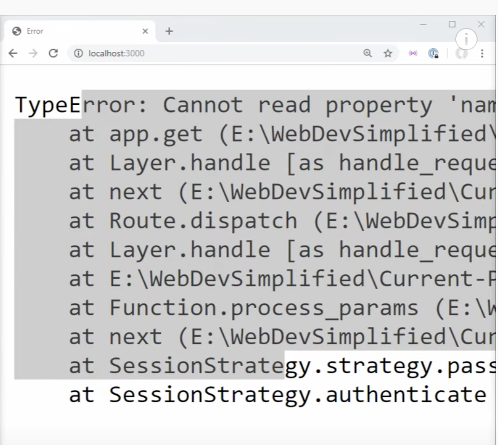

 # Nodejs-Passport-Login[ tutorial](https://youtu.be/-RCnNyD0L-s)

## Before you get started:
1.  `.gitignore ` ignores `.env` so you may need to create one during installation and setup.  

1. The tutorial uses code shortcuts and project architecture that they themselves strongly discourage from use in a production environment.  

Gotta watch the video for more info lol

## Setup & Installation
First steps: fork/clone, `cd` into your root directory, `npm install` .  

Next, invoke  ```npm devStart``` which runs nodemon, [a devDependency] , watching server.js on port3000.  

## Notes on *"database"* and authentication: 

### *Tutorial timestamp@ 14:00* 
This node app does NOT hit an *external* db.  
Our *"database"* ... is initialized as an empty array, inside `server.js`>> `const users = []`. 

The new user object creates id's as a timestamp,  and the user's p/w is stored as a hashed password, meaning:  more secure

### *Tutorial timestamp@ 14:20*
Tutorial claims that anytime application saves/reloads, the variable `users` will be reset to its original state, that is, an empty array.
**Open question, How to verify ``` server.js:``` >>  ```const users = []```?**


### Tutorial *23:30*
 ```npm install express-session && express-flash```
the express-session library retrieves secretkey from .env file


express-flash library

### Tutorial *timestamp 24:00*
`server.js`
the conditional written at top of server.js file asks whether node environment status is !"in production",
prompting  require the dotenv package, which is listed as a devDependency in package.json
### Tutorial *timestamp ~30:00*
the power of using `session` with `passport`, is that `req.user` will ALWAYS be set to the user that is authenticated, at that moment.

One problem, though: a non-authenticated user may still access  `localhost:3000/` and find *some* information, for example:


Thus, middleware aka Passport.  Executes a function with 3 args(req,res,next)

Thus, non-credentialed/non-logged in traffic redirects to `/register`

if(user is authenticated by PassPort){return: go to the next}
else redirect them to `/Register` route

npm i method-override to change POST method to DELETE.

### Next steps: 

i've struggled with Auth0 and React-Router-Dom v5 useHistory vs v6 useNavigate 
and  auth  to state-quarters-collector

I aim to integrate this repo into state-quarter-collector.onrender.com once it's up there i am confident that the data will persist.
